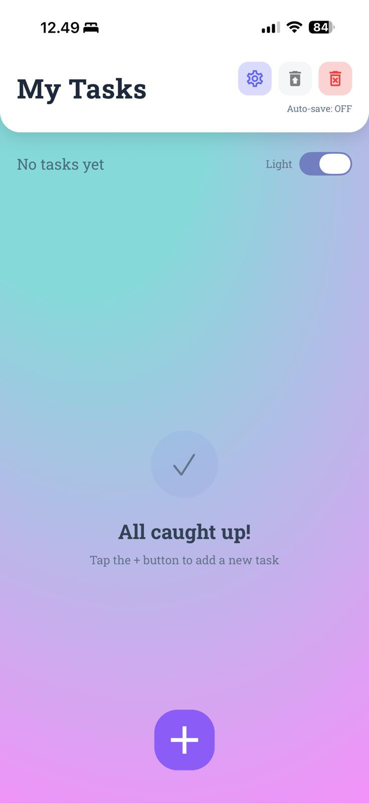
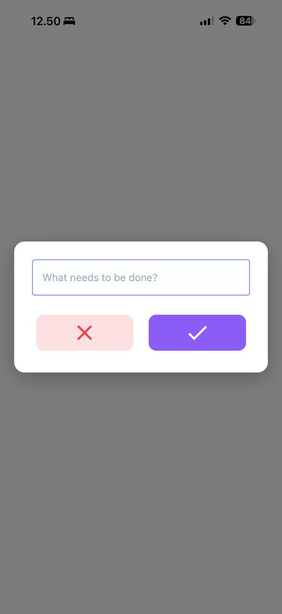
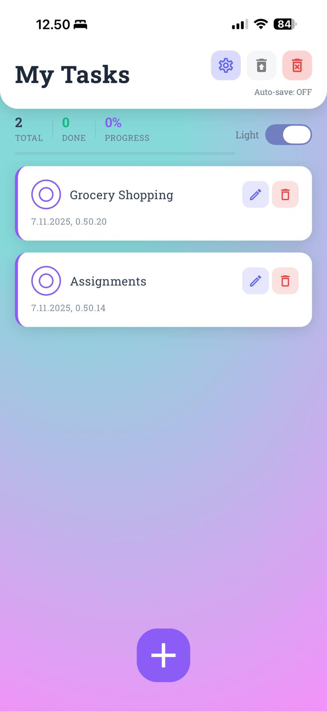
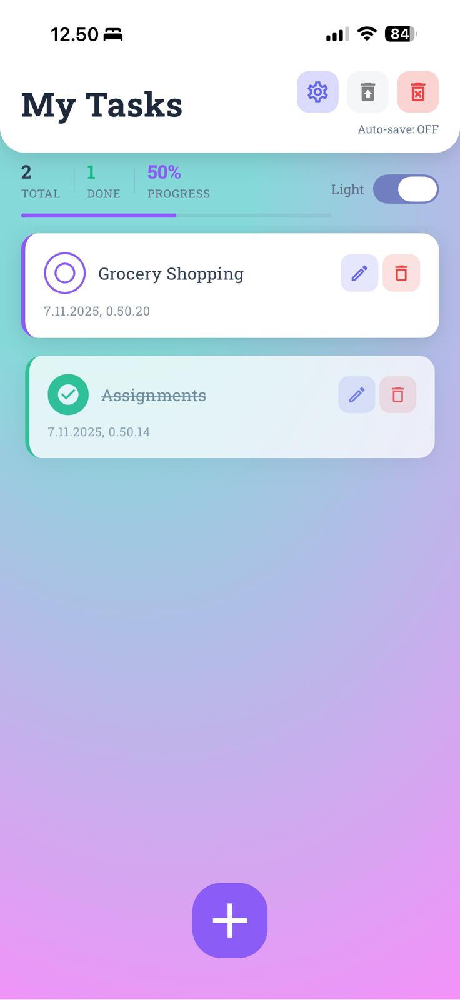
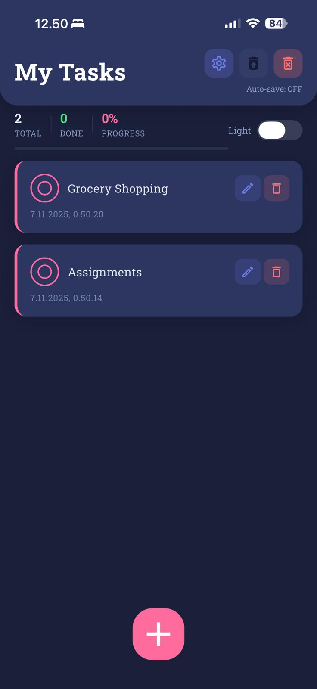
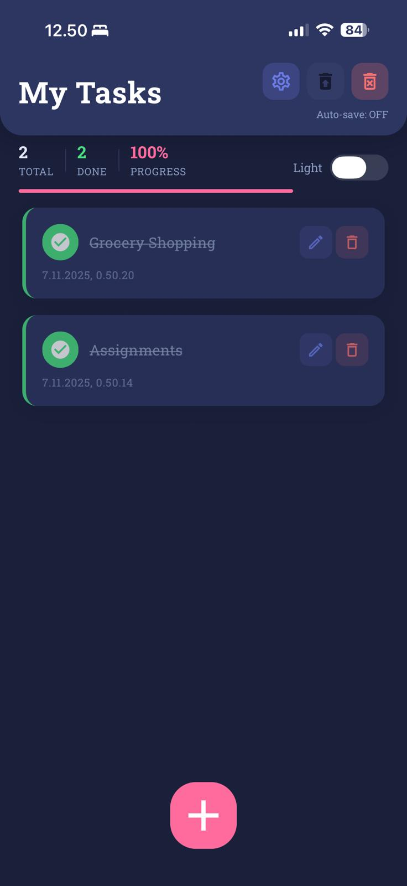

# 📝 Todo List App

A beautiful, modern, and feature-rich Todo List application built with React Native and Expo. This app provides a premium user experience with smooth animations, dark/light theme support, and intuitive task management.


## ✨ Features

- ✅ **Task Management**: Create, edit, delete, and mark tasks as complete
- 🎨 **Premium UI/UX**: Modern design with smooth animations and beautiful shadows
- 🌓 **Theme Support**: Switch between dark and light themes
- 📊 **Progress Tracking**: Visual progress bar and completion statistics
- 💾 **Auto-save**: Automatic data persistence with AsyncStorage
- 🔄 **Restore Functionality**: Restore deleted tasks with auto-save feature
- 📱 **Cross-platform**: Works on iOS, Android, and Web
- 🎯 **Empty State**: Beautiful empty state when no tasks exist
- ⚡ **Smooth Animations**: Fluid transitions and micro-interactions
- 🎨 **Safe Area Support**: Proper handling of notches and home indicators

## 🚀 Getting Started

### Prerequisites

- Node.js (v14 or higher)
- npm or yarn
- Expo CLI (optional, but recommended)
- iOS Simulator (for iOS development) or Android Emulator (for Android development)

### Installation

1. **Clone the repository**
   ```bash
   git clone <repository-url>
   cd Todo-List-React-Native-App
   ```

2. **Install dependencies**
   ```bash
   npm install
   # or
   yarn install
   ```

3. **Start the development server**
   ```bash
   npm start
   # or
   yarn start
   ```

4. **Run on your preferred platform**
   - **iOS**: Press `i` in the terminal or run `npm run ios`
   - **Android**: Press `a` in the terminal or run `npm run android`
   - **Web**: Press `w` in the terminal or run `npm run web`

## 📱 Usage

### Creating a Task
1. Tap the floating action button (FAB) at the bottom of the screen
2. Enter your task in the modal
3. Tap the checkmark button to save

### Managing Tasks
- **Complete a task**: Tap the circle icon next to a task
- **Edit a task**: Tap the pencil icon on a task card
- **Delete a task**: Tap the delete icon on a task card
- **Delete all tasks**: Tap the trash icon in the header

### Theme Switching
- Toggle the "Light" switch in the stats section to switch between dark and light themes

### Restore Deleted Tasks
- Enable "Auto-save" in settings (gear icon)
- Use the restore icon in the header to restore previously deleted tasks

## 🛠️ Tech Stack

- **Framework**: React Native 0.81.5
- **Build Tool**: Expo SDK 54
- **UI Library**: React Native Paper 5.12.5
- **Animations**: React Native Animatable 1.4.0
- **Storage**: AsyncStorage 2.1.0
- **Safe Areas**: React Native Safe Area Context 5.6.2
- **Fonts**: Expo Google Fonts (Roboto Slab)
- **React**: 19.1.0

## 📁 Project Structure

```
Todo-List-React-Native-App/
├── App.js                 # Main app component
├── app.json              # Expo configuration
├── babel.config.js      # Babel configuration
├── package.json         # Dependencies and scripts
├── assets/              # Images and icons
│   ├── icon.png
│   ├── splash.png
│   ├── adaptive-icon.png
│   ├── background.png
│   └── favicon.png
├── components/          # React components
│   ├── AddToDoIcon.js   # Floating action button
│   ├── EmptyState.js    # Empty state component
│   ├── Header.js        # App header with actions
│   ├── HomeScreen.js    # Main screen component
│   ├── ListItems.js     # Task list component
│   ├── ModalView.js     # Add/edit task modal
│   └── TodosStatusandThemeIconComponent.js  # Stats and theme toggle
└── styles/              # Theme configuration
    └── theme.js         # Dark and light themes
```

## 🎨 Customization

### Themes
The app supports two themes defined in `styles/theme.js`:
- **Dark Theme**: Modern dark color scheme
- **Light Theme**: Clean light color scheme

You can customize colors, sizes, and shadows in the theme file.

### Configuration
Edit `app.json` to customize:
- App name and description
- App icon and splash screen
- Platform-specific settings
- Bundle identifier

## 📦 Building for Production

### Android
```bash
eas build --platform android
```

### iOS
```bash
eas build --platform ios
```

Make sure you have `eas.json` configured for EAS Build.

## 🔧 Available Scripts

- `npm start` - Start Expo development server
- `npm run android` - Run on Android device/emulator
- `npm run ios` - Run on iOS device/simulator
- `npm run web` - Run on web browser

## 📸 Screenshots

<div align="center">
  
  
  
</div>

<div align="center">
  
  
  
</div>

## 🤝 Contributing

Contributions are welcome! Please feel free to submit a Pull Request.

1. Fork the repository
2. Create your feature branch (`git checkout -b feature/AmazingFeature`)
3. Commit your changes (`git commit -m 'Add some AmazingFeature'`)
4. Push to the branch (`git push origin feature/AmazingFeature`)
5. Open a Pull Request

## 📝 License

This project is licensed under the MIT License - see the LICENSE file for details.


## 📄 Version History

- **v2.0.0** - Premium UI redesign with stats, progress tracking, and enhanced animations
- **v1.0.0** - Initial release with basic todo functionality

---

Made with ❤️ using React Native and Expo

